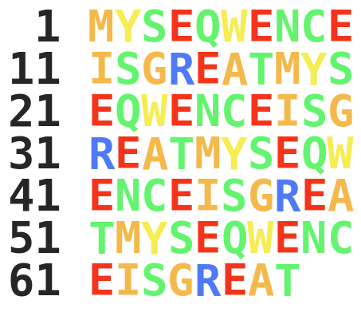
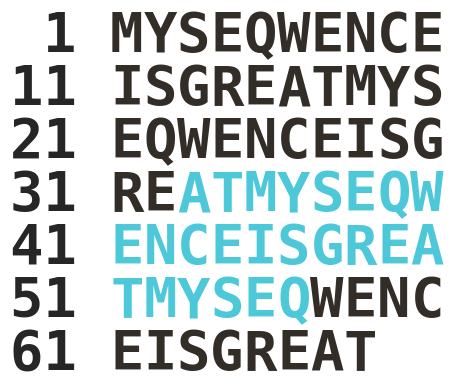

# sequence-colouring

Make quick pictures of sequences in fasta files using [matplotlib](https://matplotlib.org/)

Work in progress. Seems to require matplotlib=3.9 to work on reasonable timescales

## example

### default behaviour
`./sequence_colouring.py -f short.fasta -o example_default.png`

### no counts

`./sequence_colouring.py -f example.fasta -o example_nocount.png -c`

### special highlighting

`./sequence_colouring.py -f example.fasta -o example_subseq.png -l 33 -u 56`

### only show a subsequence

`./sequence_colouring.py -f example.fasta -o example_subseq_highlight.png -l 33 -u 56 -b 32 -e 62`

